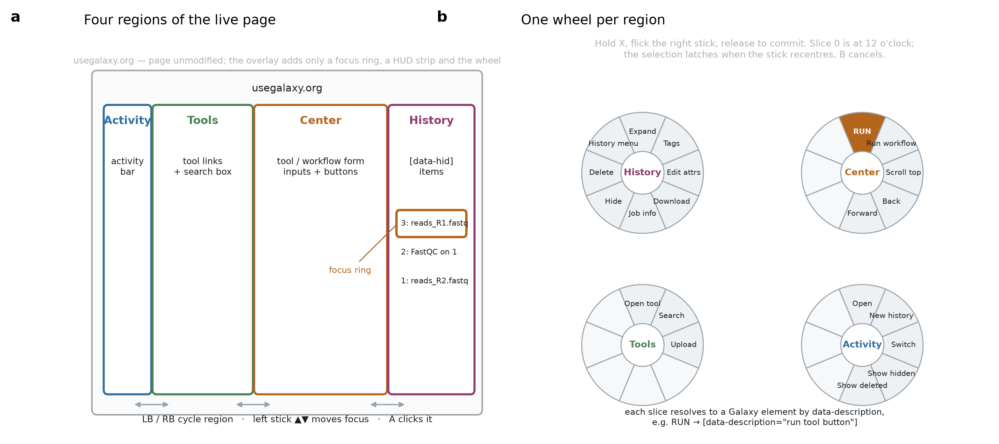

# Galaxy Gamepad

Operate the [Galaxy](https://usegalaxy.org/) bioinformatics platform with a game
controller — inside the real web interface, not a replacement for it.

The overlay adds a focus ring, a HUD strip and a radial menu. Galaxy's own DOM
is never rewritten, there is no local server, and there is no API key: job
state is read from Galaxy's API on the session you are already logged into.



## Why

- **Accessibility.** Galaxy's interface asks for sustained precise pointing over
  small targets. A controller asks for none, and users who already rely on
  adaptive hardware (Xbox Adaptive Controller, Logitech Adaptive Gaming Kit,
  one-handed pads) get a path into the platform that does not exist today.
- **Monitoring ergonomics.** Most of the wall-clock time in a Galaxy analysis is
  spent waiting on jobs and triaging the ones that failed. Haptics turn that
  into an ambient channel: a double pulse when a job finishes, a long buzz when
  one fails, without looking at a tab.
- **Execution is controller-shaped.** The pad is weak at authoring and strong at
  running things. Navigate, set parameters, press Run, feel the result.

## Install

**Userscript** — install Tampermonkey or Violentmonkey, create a new script,
paste [`extension/galaxy-gamepad.user.js`](extension/galaxy-gamepad.user.js).

**Unpacked extension** — `chrome://extensions` → Developer mode → *Load
unpacked* → select [`extension/`](extension/).

Then open Galaxy and press any button on the controller. Browsers deliver no
gamepad input until the page has seen a gesture.

Every binding has a keyboard equivalent, so it is usable and testable without
hardware. Full binding table, haptic vocabulary and the repair procedure are in
[`extension/README.md`](extension/README.md).

## How it stays working

Operating a page from the outside is brittle; this is where the design effort
went.

Every target is addressed through one `SELECTORS` table, and each entry is a
list of fallback candidates. Selectors use Galaxy's `data-description`
attributes rather than CSS classes or DOM paths — the live
`analysis.bundled.js` on Galaxy Main (version 26.1) defines **249 distinct
values**, including `run tool button`, `execute workflow button`,
`history options`, `dataset download` and `job information modal`. Those
attributes exist to be addressed from outside the client.

Press **View** in the page to open the **selector doctor**: it lists every
logical target, marks which resolved on the page in front of you, and prints
the candidate that matched. A Galaxy release becomes a one-table edit you can
diagnose in seconds.

## Tests

```bash
npm install
npm test
```

16 assertions run the script in jsdom against a synthetic Galaxy DOM built from
the same `data-description` attributes: overlay injection, focus navigation,
real click dispatch, radial routing to the correct target, the typing guard,
the pause toggle, the selector doctor, and the job-state → haptics path
including baseline suppression, back-off, and the signed-out case.

Not verified: behaviour against the live Galaxy page. jsdom has no layout
engine, so geometric focus ordering runs on synthesised rectangles, and the
selector pack was checked against the shipped client bundle rather than a
rendered page. Expect to open the selector doctor on first run.

## Layout

```
extension/
  galaxy-gamepad.user.js   the whole tool: input, overlay, selectors, haptics
  manifest.json            MV3 wrapper for loading unpacked
  README.md                bindings, haptics, selector-repair procedure
tests/test_userscript.mjs  jsdom suite
docs/design-sketch.md      original design reasoning (architecture since revised)
```

## Status

Early. The interaction model is settled and tested; the selector pack has not
met the live page. Text entry is Galaxy's own — focus a field with the pad,
then type. Binding remapping, a controller-driven keyboard, and the
accessibility presets (one-handed, switch-access, no-chord guarantee) are not
built yet.

## License

MIT — see [LICENSE](LICENSE).
